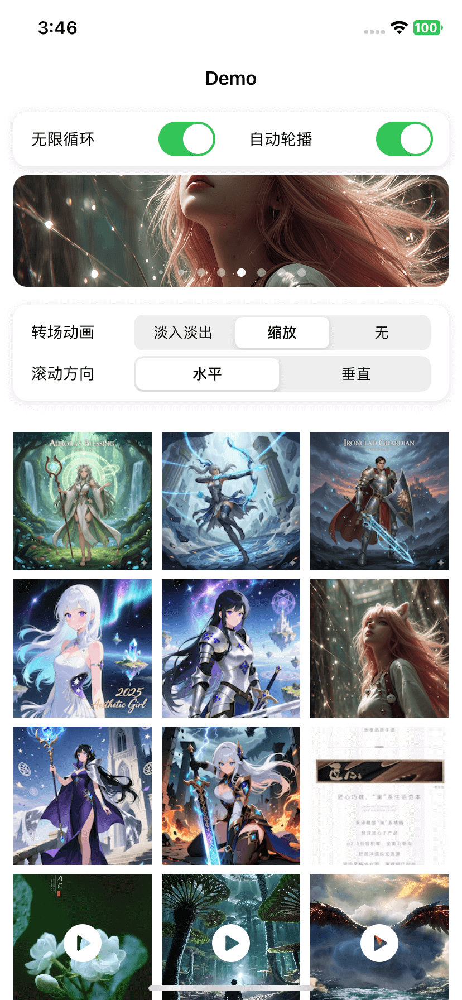
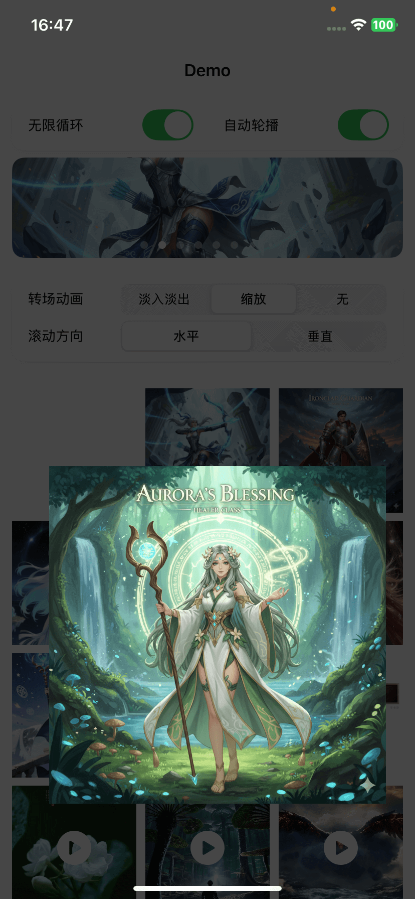

# JXPhotoBrowser

[](https://cocoapods.org/pods/JXPhotoBrowser) [](https://swift.org/package-manager/) [](https://github.com/Carthage/Carthage) [](LICENSE)

[English Documentation](README_EN.md)

JXPhotoBrowser 是一个轻量、可定制的 iOS 图片/视频浏览器。核心基于 UIKit 和 `UICollectionView`，支持缩放、拖拽关闭、循环滚动、自动轮播、Zoom/Fade 转场与自定义 Cell，不绑定业务数据模型，也不内置图片加载库。

| 首页列表 | 图片浏览 | 下拉关闭 |
| :---: | :---: | :---: |
|  |  |  |

## 特性

- UIKit 核心，SwiftUI 可通过桥接层集成
- 水平/垂直整页浏览与无限循环
- 双击、捏合缩放和可配置固定双击倍率
- 下拉关闭、Zoom/Fade/None 转场
- 程序化跳页、自动轮播和页间距
- 自定义 Cell 与 Overlay 扩展机制
- CocoaPods、SwiftPM、Carthage
- iOS 12.0+、Swift 5.4+

## 安装

### CocoaPods

```ruby
pod 'JXPhotoBrowser', '~> 4.1'
```

### Swift Package Manager

```swift
dependencies: [
    .package(url: "https://github.com/JiongXing/PhotoBrowser", from: "4.1.0")
]
```

### Carthage

```text
github "JiongXing/PhotoBrowser" ~> 4.1
```

```bash
carthage update --use-xcframeworks --platform iOS
```

三种集成方式都会携带 `PrivacyInfo.xcprivacy`。框架不追踪用户、不收集数据，也不使用 Required Reason API。

## 快速开始

```swift
import JXPhotoBrowser

let browser = JXPhotoBrowserViewController()
browser.delegate = self
browser.initialIndex = indexPath.item
browser.transitionType = .zoom
browser.isLoopingEnabled = true
browser.addOverlay(JXPageIndicatorOverlay())
browser.present(from: self)
```

```swift
extension ViewController: JXPhotoBrowserDelegate {
    func numberOfItems(in browser: JXPhotoBrowserViewController) -> Int {
        items.count
    }

    func photoBrowser(
        _ browser: JXPhotoBrowserViewController,
        cellForItemAt index: Int,
        at indexPath: IndexPath
    ) -> JXPhotoBrowserAnyCell {
        browser.dequeueReusableCell(
            withReuseIdentifier: JXZoomImageCell.reuseIdentifier,
            for: indexPath
        )
    }

    func photoBrowser(
        _ browser: JXPhotoBrowserViewController,
        willDisplay cell: JXPhotoBrowserAnyCell,
        at index: Int
    ) {
        guard let cell = cell as? JXZoomImageCell else { return }
        // 使用业务方选择的图片加载库设置 cell.imageView.image
    }

    func photoBrowser(
        _ browser: JXPhotoBrowserViewController,
        thumbnailViewAt index: Int
    ) -> UIView? {
        let indexPath = IndexPath(item: index, section: 0)
        return collectionView.cellForItem(at: indexPath)?.contentView
    }
}
```

数据变化后通过框架入口重载，不要直接操作内部 collectionView：

```swift
browser.reloadData()                              // 保留并钳制当前页
browser.reloadData(preservingCurrentPage: false) // 回到 initialIndex
```

## 内嵌 Banner

内嵌模式必须使用标准 View Controller containment，并关闭下拉关闭手势：

```swift
let browser = JXPhotoBrowserViewController()
browser.delegate = self
browser.transitionType = .none
browser.isDismissGestureEnabled = false
browser.autoPlayInterval = 3
browser.isAutoPlayEnabled = true

addChild(browser)
containerView.addSubview(browser.view)
// 为 browser.view 添加约束
browser.didMove(toParent: self)
```

移除时依次调用 `willMove(toParent: nil)`、移除 view、`removeFromParent()`。

## 文档

- [详细使用指南](Documentation/Guides.md)
- [4.0 → 4.1 迁移指南](Documentation/Migration-4.1.md)
- [技术方案](TECHNICAL_SOLUTION.md)
- [更新记录](CHANGELOG.md)

## 已知限制

- 浏览器固定竖屏，不支持设备旋转。
- 垂直滚动模式下不启用下拉关闭。
- 每个 Cell 固定为浏览器整页尺寸；4.1 不再支持逐项自定义尺寸。

## CocoaPods 故障排查

如果 Xcode 的 User Script Sandboxing 导致 CocoaPods 的资源复制或 framework 嵌入脚本明确报出沙盒访问错误，可在受影响 Target 中评估将 `ENABLE_USER_SCRIPT_SANDBOXING` 设为 `NO`。没有相关错误时无需修改该设置。

## License

MIT License
