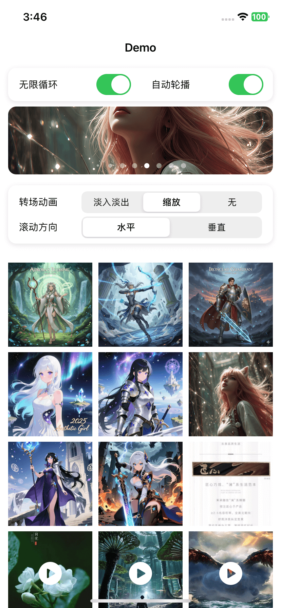

# JXPhotoBrowser

[](https://github.com/JiongXing/PhotoBrowser/releases) [](https://cocoapods.org/pods/JXPhotoBrowser) [](https://swift.org/package-manager/) [](https://github.com/Carthage/Carthage) [](https://cocoapods.org/pods/JXPhotoBrowser) [](LICENSE)

[中文文档](README.md)

JXPhotoBrowser is a lightweight, customizable iOS photo/video browser that delivers an experience similar to the native iOS Photos app. It supports zooming, drag-to-dismiss, custom transition animations, and more. The architecture is clean and easy to integrate and extend. It supports both **UIKit** and **SwiftUI** (SwiftUI integration via a bridging layer — see the Demo-SwiftUI sample project).

| Home List | Photo Browsing | Pull down to close |
| :---: | :---: | :---: |
|  |  |  |

## Core Design

- **Zero Data-Model Dependency**: The framework does not define any data models. You use your own data structures entirely, configuring cell content through the delegate.
- **Fully Open Image Loading**: The framework does not include any built-in image loading logic. You are free to use Kingfisher, SDWebImage, or any other image loading library.
- **Minimal Cell Protocol**: `JXPhotoBrowserCellProtocol` contains only two properties — `browser` and `transitionImageView` — decoupling the browser from specific cell implementations. You can use the built-in `JXZoomImageCell` or create fully custom cells.
- **Protocol-Driven Data & UI Decoupling**: `JXPhotoBrowserDelegate` only handles count, cells, and transitions — no unified data model is enforced.

## Features

- **Multi-Mode Browsing**: Supports both horizontal and vertical scrolling.
- **Infinite Looping**: Seamless looping with smooth transitions between first and last items.
- **Gesture Interactions**:
  - **Double-Tap Zoom**: Mimics the native Photos app double-tap zoom behavior.
  - **Pinch-to-Zoom**: Supports two-finger pinch zoom (1.0x – 3.0x).
  - **Drag-to-Dismiss**: Interactive pan-down gesture to dismiss, with image scaling and background fade effects.
- **Transition Animations**:
  - **Fade**: Classic fade-in/fade-out effect.
  - **Zoom**: WeChat/Photos-style zoom transition, seamlessly connecting the list thumbnail to the full-size image.
  - **None**: No animation, displays immediately.
- **Optimized Browsing Experience**: Built on `UICollectionView` reuse mechanism for low memory usage and smooth scrolling.
- **Custom Cell Support**: Ships with `JXZoomImageCell`, and also supports fully custom cells (e.g., video player cells) via protocol and registration.
- **Overlay Component System**: Supports on-demand overlay components (e.g., page indicators, close buttons). No overlays are loaded by default — zero overhead. Ships with a built-in `JXPageIndicatorOverlay`.

## Core Architecture

- **JXPhotoBrowserViewController**: Core view controller, subclass of `UIViewController`. Internally manages a `UICollectionView` for displaying pages, handling global configuration (scroll direction, looping) and gesture interactions (drag-to-dismiss).
- **JXZoomImageCell**: Zoomable image cell, subclass of `UICollectionViewCell` conforming to `JXPhotoBrowserCellProtocol`. Uses `UIScrollView` for zooming and handles single-tap/double-tap interactions. Exposes an `imageView` property for image loading.
- **JXImageCell**: Lightweight image cell without zoom gestures, suitable for embedded scenarios such as banners. Includes an optional loading indicator (disabled by default) with customizable styling.
- **JXPhotoBrowserCellProtocol**: Minimal cell protocol requiring only `browser` (weak reference to the browser) and `transitionImageView` (transition view). Provides an optional `photoBrowserDismissInteractionDidChange` method for responding to drag-to-dismiss interactions. No specific base class is required.
- **JXPhotoBrowserDelegate**: Delegate protocol for providing item count, cell instances, lifecycle callbacks (`willDisplay`/`didEndDisplaying`), and thumbnail views for transition animations. No unified data model is enforced.
- **JXPhotoBrowserOverlay**: Overlay component protocol defining `setup`, `reloadData`, and `didChangedPageIndex` methods for unified integration of supplementary UI such as page indicators and close buttons.
- **JXPageIndicatorOverlay**: Built-in page indicator component based on `UIPageControl`, with customizable position and styling, loaded on demand via `addOverlay`.

## Dependencies

- Framework dependency: `UIKit` (core) — **no third-party dependencies**.
- Image loading: The framework does not include built-in image loading logic. You are free to use Kingfisher, SDWebImage, or any other library.
- Sample projects:
  - **Demo-UIKit**: UIKit demo using CocoaPods, depends on `Kingfisher` for image loading. Demonstrates full features (photo browsing, video playback, banner carousel, etc.).
  - **Demo-SwiftUI**: SwiftUI demo using SPM. Demonstrates how to use JXPhotoBrowser in SwiftUI via a bridging layer (media grid, settings panel, photo browsing).
  - **Demo-Carthage**: UIKit demo using Carthage. On first use, run `carthage update --use-xcframeworks --platform iOS` in the `Demo-Carthage` directory to build the framework.

## Requirements

- iOS 11.0+
- Swift 5.4+

## Installation

### CocoaPods

Add to your `Podfile`:

```ruby
pod 'JXPhotoBrowser'
```

### Swift Package Manager

In Xcode:

1. Select **File > Add Package Dependencies...**
2. Enter the repository URL: `https://github.com/JiongXing/PhotoBrowser`
3. Choose a version rule and click **Add Package**

Or add the dependency in your `Package.swift`:

```swift
dependencies: [
    .package(url: "https://github.com/JiongXing/PhotoBrowser", from: "4.0.0")
]
```

### Carthage

Add to your `Cartfile`:

```
github "JiongXing/PhotoBrowser"
```

Then run:

```bash
carthage update --use-xcframeworks --platform iOS
```

Once the build is complete, drag `Carthage/Build/JXPhotoBrowser.xcframework` into your Xcode project's **Frameworks, Libraries, and Embedded Content** section, and set it to **Embed & Sign**.

### Manual Installation

Drag all files from the `Sources` directory into your project.

## Quick Start

### Basic Usage

```swift
import JXPhotoBrowser

// 1. Create a browser instance
let browser = JXPhotoBrowserViewController()
browser.delegate = self
browser.initialIndex = indexPath.item // Set the initial index

// 2. Configure options (optional)
browser.scrollDirection = .horizontal // Scroll direction
browser.transitionType = .zoom        // Transition animation type
browser.isLoopingEnabled = true       // Enable infinite looping

// 3. Present
browser.present(from: self)
```

### Implementing the Delegate

Conform to `JXPhotoBrowserDelegate` to provide data and transition support:

```swift
import Kingfisher // Example uses Kingfisher — can be replaced with any image loading library

extension ViewController: JXPhotoBrowserDelegate {
    // 1. Return the total number of items
    func numberOfItems(in browser: JXPhotoBrowserViewController) -> Int {
        return items.count
    }
    
    // 2. Provide the cell for display
    func photoBrowser(_ browser: JXPhotoBrowserViewController, cellForItemAt index: Int, at indexPath: IndexPath) -> JXPhotoBrowserAnyCell {
        let cell = browser.dequeueReusableCell(withReuseIdentifier: JXZoomImageCell.reuseIdentifier, for: indexPath) as! JXZoomImageCell
        return cell
    }
    
    // 3. Load the image when the cell is about to be displayed
    func photoBrowser(_ browser: JXPhotoBrowserViewController, willDisplay cell: JXPhotoBrowserAnyCell, at index: Int) {
        guard let photoCell = cell as? JXZoomImageCell else { return }
        let item = items[index]
        
        // Load image using Kingfisher (replaceable with SDWebImage or others)
        let placeholder = ImageCache.default.retrieveImageInMemoryCache(forKey: item.thumbnailURL.absoluteString)
        photoCell.imageView.kf.setImage(with: item.originalURL, placeholder: placeholder) { [weak photoCell] _ in
            photoCell?.setNeedsLayout()
        }
    }
    
    // 4. (Optional) Clean up resources when cell ends displaying (e.g., cancel loading, stop playback)
    func photoBrowser(_ browser: JXPhotoBrowserViewController, didEndDisplaying cell: JXPhotoBrowserAnyCell, at index: Int) {
        // Cancel image loading, stop video playback, etc.
    }
    
    // 5. (Optional) Support Zoom transition: provide the thumbnail view from the list
    func photoBrowser(_ browser: JXPhotoBrowserViewController, thumbnailViewAt index: Int) -> UIView? {
        let indexPath = IndexPath(item: index, section: 0)
        guard let cell = collectionView.cellForItem(at: indexPath) as? MyCell else { return nil }
        return cell.imageView
    }
    
    // 6. (Optional) Control thumbnail visibility to avoid visual overlap during Zoom transition
    func photoBrowser(_ browser: JXPhotoBrowserViewController, setThumbnailHidden hidden: Bool, at index: Int) {
        let indexPath = IndexPath(item: index, section: 0)
        if let cell = collectionView.cellForItem(at: indexPath) as? MyCell {
            cell.imageView.isHidden = hidden
        }
    }
    
    // 7. (Optional) Custom cell size — defaults to the browser's full-screen size
    func photoBrowser(_ browser: JXPhotoBrowserViewController, sizeForItemAt index: Int) -> CGSize? {
        return nil // Return nil to use the default size
    }
}
```

## Using with SwiftUI

JXPhotoBrowser is a UIKit-based framework. In SwiftUI projects, it can be integrated via a bridging layer. The Demo-SwiftUI sample project demonstrates the complete integration approach.

### Core Approach

1. **Grid and settings panel** are built with pure SwiftUI (`LazyVGrid`, `Picker`, `AsyncImage`, etc.)
2. **Full-screen photo browser** is invoked through the bridging layer calling `JXPhotoBrowserViewController`
3. Create a Presenter class conforming to `JXPhotoBrowserDelegate`, obtain the current `UIViewController`, and call `browser.present(from:)`

### Bridging Layer Example

```swift
import JXPhotoBrowser

/// Encapsulates the creation, configuration, and presentation of JXPhotoBrowserViewController
final class PhotoBrowserPresenter: JXPhotoBrowserDelegate {
    private let items: [MyMediaItem]

    func present(initialIndex: Int) {
        guard let viewController = topViewController() else { return }

        let browser = JXPhotoBrowserViewController()
        browser.delegate = self
        browser.initialIndex = initialIndex
        browser.transitionType = .fade
        browser.addOverlay(JXPageIndicatorOverlay())
        browser.present(from: viewController)
    }

    func numberOfItems(in browser: JXPhotoBrowserViewController) -> Int {
        items.count
    }

    func photoBrowser(_ browser: JXPhotoBrowserViewController, cellForItemAt index: Int, at indexPath: IndexPath) -> JXPhotoBrowserAnyCell {
        browser.dequeueReusableCell(withReuseIdentifier: JXZoomImageCell.reuseIdentifier, for: indexPath) as! JXZoomImageCell
    }

    func photoBrowser(_ browser: JXPhotoBrowserViewController, willDisplay cell: JXPhotoBrowserAnyCell, at index: Int) {
        guard let photoCell = cell as? JXZoomImageCell else { return }
        // Load image into photoCell.imageView ...
    }
}
```

### Calling from a SwiftUI View

```swift
struct ContentView: View {
    // Hold the presenter (JXPhotoBrowserViewController.delegate is weak — requires external strong reference)
    @State private var presenter: PhotoBrowserPresenter?

    var body: some View {
        LazyVGrid(columns: columns) {
            ForEach(Array(items.enumerated()), id: \.element.id) { index, item in
                AsyncImage(url: item.thumbnailURL)
                    .onTapGesture {
                        let p = PhotoBrowserPresenter(items: items)
                        presenter = p
                        p.present(initialIndex: index)
                    }
            }
        }
    }
}
```

> **Note**: The `delegate` property of `JXPhotoBrowserViewController` is a `weak` reference. You must hold the Presenter instance with `@State` on the SwiftUI side, otherwise it will be deallocated immediately after creation.

### About Zoom Transition

The Demo-SwiftUI sample project does not demonstrate the Zoom transition animation and uses Fade transition by default.

**Reason**: The Zoom transition relies on the `thumbnailViewAt` delegate method to return a `UIView` reference of the list thumbnail. The framework uses this reference to calculate the animation start/end positions and build a temporary animation view. However, SwiftUI's native views like `AsyncImage` cannot directly provide the underlying `UIView` reference.

**To implement it yourself**: Replace the thumbnail from `AsyncImage` with a `UIViewRepresentable`-wrapped `UIImageView` to obtain a real `UIView` reference. Then provide it to the framework via the `thumbnailViewAt` and `setThumbnailHidden` delegate methods. Refer to the Demo-UIKit sample project for specific Zoom transition integration details.

## JXImageCell Loading Indicator

`JXImageCell` includes a built-in `UIActivityIndicatorView` loading indicator, **disabled by default**. Suitable for displaying image loading state in embedded scenarios like banners.

### Enabling the Loading Indicator

```swift
let cell = browser.dequeueReusableCell(withReuseIdentifier: JXImageCell.reuseIdentifier, for: indexPath) as! JXImageCell

// Enable the loading indicator
cell.isLoadingIndicatorEnabled = true
cell.startLoading()

// Stop loading after image is loaded
cell.imageView.kf.setImage(with: imageURL) { [weak cell] _ in
    cell?.stopLoading()
}
```

### Customizing the Style

You can customize the indicator's appearance via the `loadingIndicator` property:

```swift
cell.loadingIndicator.style = .large       // Indicator size
cell.loadingIndicator.color = .systemBlue  // Indicator color
```

## Custom Cells

The framework supports two approaches for creating custom cells:

### Approach 1: Subclass JXZoomImageCell (Recommended)

Subclassing `JXZoomImageCell` automatically provides zoom, transition, and gesture capabilities. For example, `VideoPlayerCell` in the Demo subclasses `JXZoomImageCell` and adds video playback:

```swift
class VideoPlayerCell: JXZoomImageCell {
    static let videoReuseIdentifier = "VideoPlayerCell"
    
    private var player: AVPlayer?
    private var playerLayer: AVPlayerLayer?
    
    override init(frame: CGRect) {
        super.init(frame: frame)
        // Custom initialization: add loading indicator, etc.
    }
    
    /// Configure video resource
    func configure(videoURL: URL, coverImage: UIImage? = nil) {
        imageView.image = coverImage
        // Create player and start playback...
    }
    
    /// Override single-tap gesture: pause video or dismiss browser
    override func handleSingleTap(_ gesture: UITapGestureRecognizer) {
        if isPlaying {
            pauseVideo()
        } else {
            browser?.dismissSelf()
        }
    }
}
```

### Approach 2: Implement the Protocol (Fully Custom)

Implement `JXPhotoBrowserCellProtocol` directly for complete freedom:

```swift
class StandaloneCell: UICollectionViewCell, JXPhotoBrowserCellProtocol {
    static let reuseIdentifier = "StandaloneCell"
    
    // Required: weak reference to the browser (to avoid retain cycles)
    weak var browser: JXPhotoBrowserViewController?
    
    // Optional: used for Zoom transition animation; return nil to use Fade animation
    var transitionImageView: UIImageView? { imageView }
    
    let imageView = UIImageView()
    
    override init(frame: CGRect) {
        super.init(frame: frame)
        // Custom initialization
    }
    
    // Optional: called when the drag-to-dismiss interaction state changes
    // isInteracting is true when the user is dragging down (image scales down following the finger),
    // false when the interaction ends (snaps back to original state)
    // Useful for pausing video, hiding supplementary UI during dismiss gesture, etc.
    func photoBrowserDismissInteractionDidChange(isInteracting: Bool) {
        // e.g., pause video playback during drag
    }
}
```

### Registering and Using Custom Cells

```swift
let browser = JXPhotoBrowserViewController()

// Register custom cell (must be done before setting the delegate)
browser.register(VideoPlayerCell.self, forReuseIdentifier: VideoPlayerCell.videoReuseIdentifier)

browser.delegate = self
browser.present(from: self)

// Use in delegate
func photoBrowser(_ browser: JXPhotoBrowserViewController, cellForItemAt index: Int, at indexPath: IndexPath) -> JXPhotoBrowserAnyCell {
    let cell = browser.dequeueReusableCell(withReuseIdentifier: VideoPlayerCell.videoReuseIdentifier, for: indexPath) as! VideoPlayerCell
    cell.configure(videoURL: url, coverImage: thumbnail)
    return cell
}
```

## Overlay Components

The framework provides a generic overlay component system for adding supplementary UI on top of the browser (e.g., page indicators, close buttons, title bars). **No overlays are loaded by default — load them on demand.**

### Using the Built-in Page Indicator

The framework ships with `JXPageIndicatorOverlay` (based on `UIPageControl`), loadable with a single line of code:

```swift
let browser = JXPhotoBrowserViewController()
browser.addOverlay(JXPageIndicatorOverlay())
```

Supports custom position and styling:

```swift
let indicator = JXPageIndicatorOverlay()
indicator.position = .bottom(padding: 20)  // Position: 20pt from bottom (also supports .top)
indicator.hidesForSinglePage = true         // Auto-hide when there's only one page
indicator.pageControl.currentPageIndicatorTintColor = .white
indicator.pageControl.pageIndicatorTintColor = .lightGray
browser.addOverlay(indicator)
```

### Custom Overlays

Implement the `JXPhotoBrowserOverlay` protocol to create custom components:

```swift
class CloseButtonOverlay: UIView, JXPhotoBrowserOverlay {
    
    func setup(with browser: JXPhotoBrowserViewController) {
        // Complete layout here (e.g., add constraints)
    }
    
    func reloadData(numberOfItems: Int, pageIndex: Int) {
        // Update when data or layout changes
    }
    
    func didChangedPageIndex(_ index: Int) {
        // Update when the page index changes
    }
}

// Load
browser.addOverlay(CloseButtonOverlay())
```

Multiple overlays can be loaded simultaneously without interference:

```swift
browser.addOverlay(JXPageIndicatorOverlay())
browser.addOverlay(CloseButtonOverlay())
```

## Saving Photos/Videos to the Photo Library

The framework does not include built-in save functionality. You can implement it yourself. The Demo demonstrates the complete flow of saving media to the system photo library via a long-press gesture and ActionSheet.

> **Prerequisite**: Configure `NSPhotoLibraryAddUsageDescription` in `Info.plist` (photo library write permission description).

### Core Steps

1. **Add a long-press gesture**: Add a `UILongPressGestureRecognizer` to your custom cell.
2. **Show an ActionSheet**: Use the `browser` property to obtain the browser view controller for presentation.
3. **Request permission and save**: Use `PHPhotoLibrary` to request permission, download, and write to the photo library.

### Example: Long-Press to Save in a Custom Cell

Using `VideoPlayerCell` from the Demo as an example, which subclasses `JXZoomImageCell` and adds long-press save capability:

```swift
import Photos

class VideoPlayerCell: JXZoomImageCell {
    
    override init(frame: CGRect) {
        super.init(frame: frame)
        // Add long-press gesture
        let longPress = UILongPressGestureRecognizer(target: self, action: #selector(handleLongPress(_:)))
        scrollView.addGestureRecognizer(longPress)
    }
    
    @objc private func handleLongPress(_ gesture: UILongPressGestureRecognizer) {
        guard gesture.state == .began else { return }
        
        let alert = UIAlertController(title: nil, message: nil, preferredStyle: .actionSheet)
        alert.addAction(UIAlertAction(title: "Save Video", style: .default) { [weak self] _ in
            self?.saveVideoToAlbum()
        })
        alert.addAction(UIAlertAction(title: "Cancel", style: .cancel))
        
        // Use the browser property to obtain the browser controller for presentation
        browser?.present(alert, animated: true)
    }
    
    private func saveVideoToAlbum() {
        guard let url = videoURL else { return }
        
        // 1. Request photo library write permission
        PHPhotoLibrary.requestAuthorization(for: .addOnly) { status in
            guard status == .authorized || status == .limited else { return }
            
            // 2. Download video (remote URLs need to be downloaded locally first)
            URLSession.shared.downloadTask(with: url) { tempURL, _, _ in
                guard let tempURL else { return }
                
                // 3. Write to photo library
                PHPhotoLibrary.shared().performChanges({
                    PHAssetChangeRequest.creationRequestForAssetFromVideo(atFileURL: tempURL)
                }) { success, error in
                    // Handle result...
                }
            }.resume()
        }
    }
}
```

Saving images follows a similar flow — replace the download part with image writing:

```swift
// Download image data
URLSession.shared.dataTask(with: imageURL) { data, _, _ in
    guard let data, let image = UIImage(data: data) else { return }
    
    PHPhotoLibrary.shared().performChanges({
        PHAssetChangeRequest.creationRequestForAsset(from: image)
    }) { success, error in
        // Handle result...
    }
}.resume()
```

## FAQ

### Q: Image size is wrong or flickering during Zoom transition?

**A**: This usually happens because the target cell's `imageView` doesn't have an image set yet when the browser opens, causing its `bounds` to be zero.

**Solution**: In the `willDisplay` delegate method, make sure to synchronously set a placeholder image. For example, when using Kingfisher:

```swift
func photoBrowser(_ browser: JXPhotoBrowserViewController, willDisplay cell: JXPhotoBrowserAnyCell, at index: Int) {
    guard let photoCell = cell as? JXZoomImageCell else { return }
    
    // Synchronously retrieve the thumbnail from cache as a placeholder
    let placeholder = ImageCache.default.retrieveImageInMemoryCache(forKey: thumbnailURL.absoluteString)
    photoCell.imageView.kf.setImage(with: imageURL, placeholder: placeholder) { [weak photoCell] _ in
        photoCell?.setNeedsLayout()
    }
}
```

This ensures the cell has an image with the correct dimensions when the transition animation starts, resulting in a smoother animation.

## Release Notes

**v4.0.0** (2026/02/10) — Full rewrite. Back to `UICollectionView`, with infinite-loop scrolling support and a new SwiftUI demo. Not backward-compatible with 3.x.

See the full release history in the [CHANGELOG](CHANGELOG.md).

## License

This project is licensed under the MIT License.
